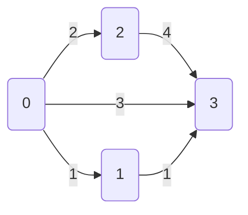

# 数据

## `cross.json`

这里保存的是所有的路口，如

```json
{
    "total":1,
    "record":[
        [0,121.50499,30.83198,"e"]
    ]
}
```

表示路口总数为 1，索引为 0 的路口经纬度为 `121.50499,30.83198`，这个路口位于 E 教。

目前启用的缩写

* `1,5,` 等数字，表示 1 号宿舍楼, 5 号宿舍楼等所在的围合
* `dh`，大活
* `a,b,c,d,e` 教学楼
* `p` 操场，下图示 1
* `lib` 图书馆
* `r1,r2` 一食堂, 二食堂

### 图示

图示 1


图示 2


图示 3


## `graph.json`

这里保存校园的图结构，如这幅图




表示成

```json
{
    "vertex": 4,
    "edge": 5,
    "adj":[
        [0,[1,1],[2,2],[3,3]],
        [1,[3,1]],
        [2,[3,4]],
        [3]
    ]
}
```

有 4 个顶点和 5 条边，用邻接表描述结构，`[[0,1,1],[0,2,2],[0,3,3]]` 表示从顶点 0 出发有 3 条边

* 0 指向 1，权重为 1
* 0 指向 2，权重为 2
* 0 指向 3，权重为 3

## Python JSON

下面以 `graph.json` 为例，介绍如何用 Python 读取 JSON 文件

```python
>>> f = open('demo/graph.json','r')
>>> raws = f.read()
>>> f.close()
>>> raws
'{\n    "vertex": 4,\n    "edge": 5,\n    "adj":[\n        [[0,1,1],[0,2,2],[0,3,3]],\n        [[1,3,1]],\n        [[2,3,4]],\n        []\n    ]\n}'
>>> json.loads(raws)
{'vertex': 4, 'edge': 5, 'adj': [[[0, 1, 1], [0, 2, 2], [0, 3, 3]], [[1, 3, 1]], [[2, 3, 4]], []]}
>>> data = json.loads(raws)
>>> data['vertex']
4
>>> data['edge']
5
>>> adj = data['adj']
>>> adj[0]
[[0, 1, 1], [0, 2, 2], [0, 3, 3]]
>>> adj[0][0]
[0, 1, 1]
>>> food = json.dumps(data)
>>> food
'{"vertex": 4, "edge": 5, "adj": [[[0, 1, 1], [0, 2, 2], [0, 3, 3]], [[1, 3, 1]], [[2, 3, 4]], []]}'
```

前后端就是用 JSON 交换数据的。


